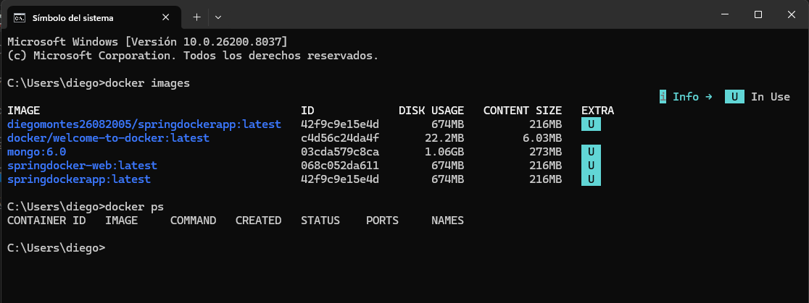
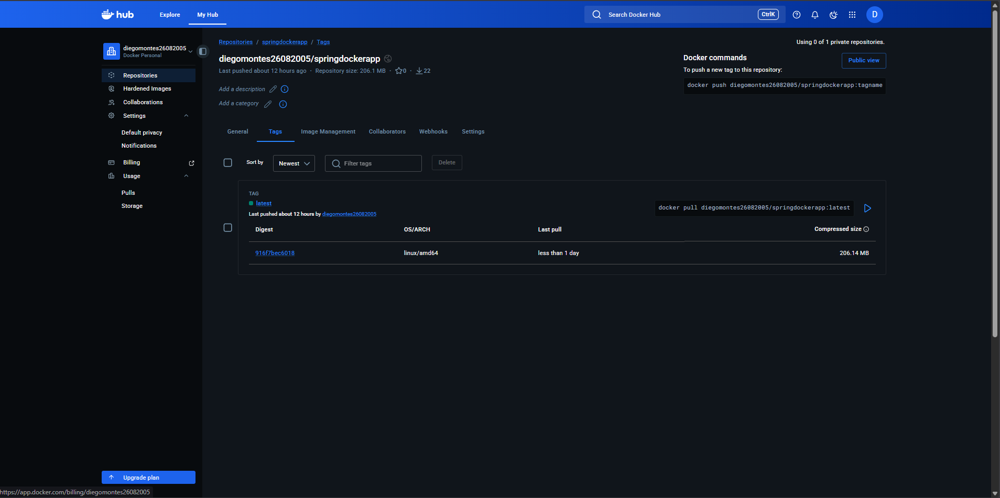
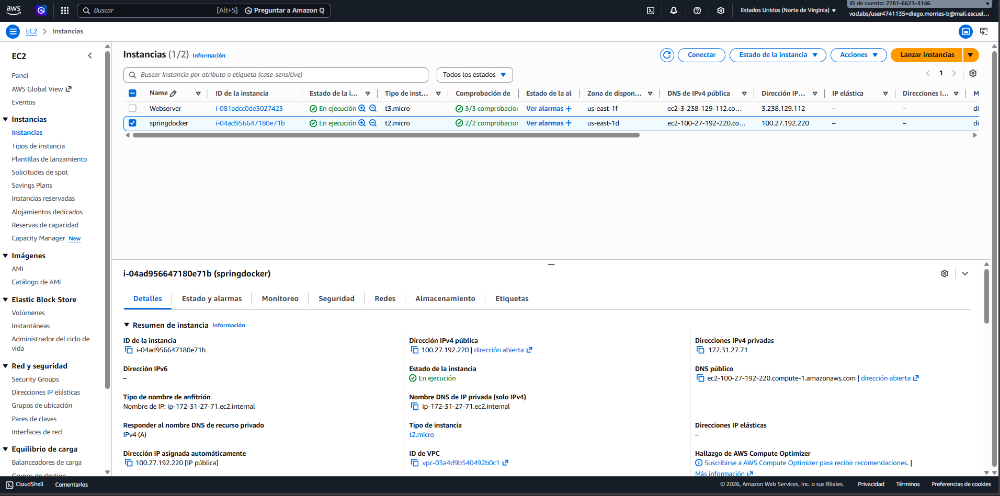
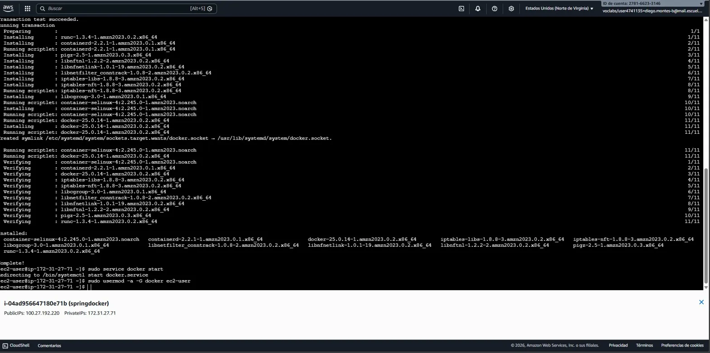
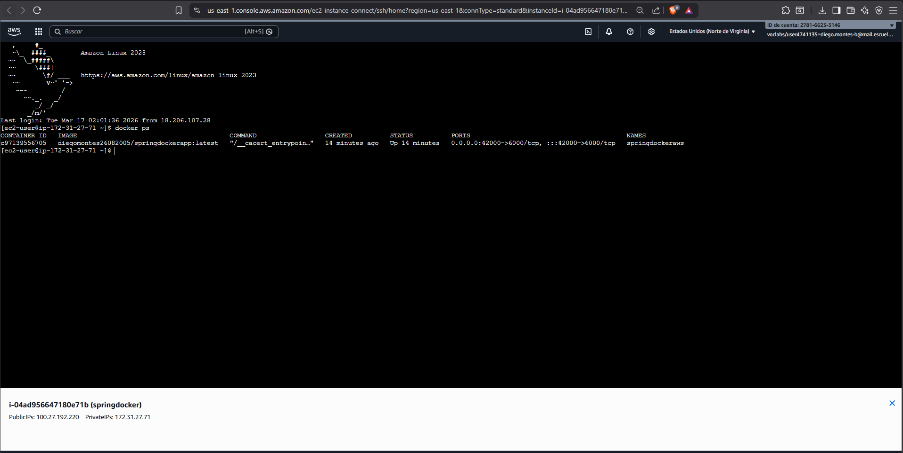
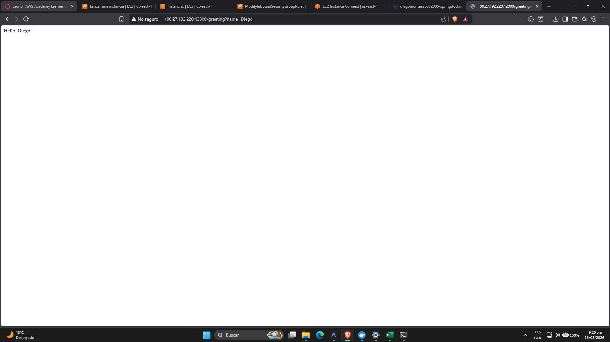
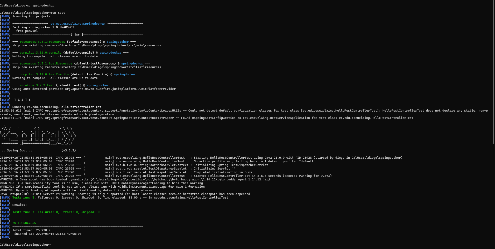

# Taller: Virtualización con Docker y AWS

- **Autor:** Diego Montes
- **Universidad:** Escuela Colombiana de Ingeniería Julio Garavito
- **Asignatura:** Arquitecturas Empresariales (AREP)

---

## Descripción del Proyecto

Aplicación web construida con **Spring Boot** que expone un endpoint REST `/greeting` el cual recibe un parámetro `name` y retorna un saludo personalizado. La aplicación se empaqueta en una imagen Docker, se publica en DockerHub y se despliega en una instancia EC2 de AWS, demostrando el flujo completo de virtualización con contenedores en la nube.

El proyecto cubre tres etapas principales: desarrollo local con Spring Boot y Maven, contenerización con Docker incluyendo múltiples instancias y docker-compose, y despliegue en producción sobre AWS EC2.

---

## Arquitectura

```
Cliente HTTP
     │
     ▼
AWS EC2 (puerto 42000)
     │
     ▼
Docker Container (42000 → 6000)
     │
     ▼
Spring Boot App
     │
     ▼
GET /greeting?name=Diego → "Hello, Diego!"
```

---

## Diseño de Clases

| Clase | Descripción |
|---|---|
| `RestServiceApplication` | Punto de entrada de Spring Boot. Lee el puerto desde la variable de entorno `PORT` (default 5000). |
| `HelloRestController` | Controlador REST. Expone el endpoint `GET /greeting?name={nombre}`. |

---

## Pre-requisitos

- Java 17+
- Maven 3.x
- Docker Desktop

---

## Despliegue con Docker

### 1. Compilar el proyecto

```bash
mvn clean install
```

### 2. Construir la imagen Docker

```bash
docker build --tag springdockerapp .
```

### 3. Correr 3 instancias del contenedor

```bash
docker run -d -p 34000:6000 --name firstdockercontainer springdockerapp
docker run -d -p 34001:6000 --name firstdockercontainer2 springdockerapp
docker run -d -p 34002:6000 --name firstdockercontainer3 springdockerapp
```

Verificar imágenes y contenedores corriendo:

```bash
docker images
docker ps
```



Accede a:
- `http://localhost:34000/greeting?name=Diego`
- `http://localhost:34001/greeting?name=Diego`
- `http://localhost:34002/greeting?name=Diego`

### 4. Docker Compose (web + MongoDB)

```bash
docker-compose up -d
```

Accede al servicio web en: `http://localhost:8087/greeting`

---

## Publicación en Docker Hub

### 1. Etiquetar y subir la imagen

```bash
docker tag springdockerapp diegomontes26082005/springdockerapp
docker login
docker push diegomontes26082005/springdockerapp:latest
```

### 2. Repositorio publicado en Docker Hub con el tag `latest`



La imagen queda disponible públicamente en: `docker.io/diegomontes26082005/springdockerapp`

Para correrla desde cualquier máquina:

```bash
docker pull diegomontes26082005/springdockerapp:latest
docker run -d -p 42000:6000 diegomontes26082005/springdockerapp:latest
```

---

## Despliegue en AWS EC2

### 1. Lanzar instancia EC2

Se crea una instancia EC2 con Amazon Linux 2023, tipo `t2.micro`.



### 2. Instalar y habilitar Docker en la instancia
```bash
sudo yum update -y
sudo yum install docker -y
sudo service docker start
sudo usermod -a -G docker ec2-user
```



### 3. Ejecutar la imagen desde Docker Hub

```bash
docker run -d --name springdockeraws -p 42000:6000 diegomontes26082005/springdockerapp:latest
```

Verificar contenedor corriendo en EC2:



### 4. Configurar Security Group (Inbound Rules)

Agregar una regla de entrada:

- **Type:** Custom TCP
- **Port range:** 42000
- **Source:** 0.0.0.0/0

### 5. Verificar acceso público

Con la instancia en ejecución, Docker activo y la regla inbound configurada, la aplicación queda accesible desde:

```
http://ec2-100-27-192-220.compute-1.amazonaws.com:42000/greeting?name=Diego
```



---

## Requisitos Técnicos

### Soporte de solicitudes concurrentes

El servidor procesa conexiones de manera concurrente mediante un pool de hilos fijo (`ExecutorService`), permitiendo atender múltiples clientes al mismo tiempo sin bloquear el ciclo principal de aceptación de sockets.

### Apagado elegante (graceful shutdown)

Se implementa un hook de runtime (`Runtime.getRuntime().addShutdownHook(...)`) que:

1. Marca el servidor en estado de apagado.
2. Cierra el `ServerSocket` de forma controlada.
3. Detiene el pool de workers esperando su finalización (`awaitTermination`) y forzando cierre si es necesario.

---

## Evidencia de Pruebas Automatizadas

Comando ejecutado:

```bash
mvn test
```

Resultado:

```
Tests run: X, Failures: 0, Errors: 0, Skipped: 0
BUILD SUCCESS
```



---

## Estructura del Proyecto

```
springdocker/
├── src/
│   └── main/
│       └── java/
│           └── co/edu/escuelaing/
│               ├── RestServiceApplication.java
│               └── HelloRestController.java
├── Dockerfile
├── docker-compose.yml
├── pom.xml
└── README.md
```

